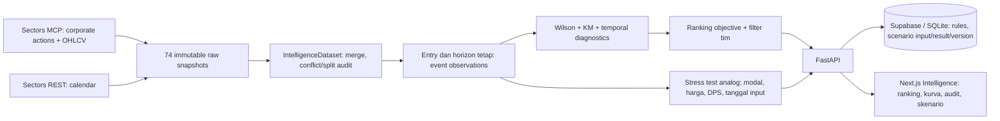
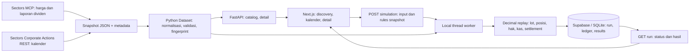
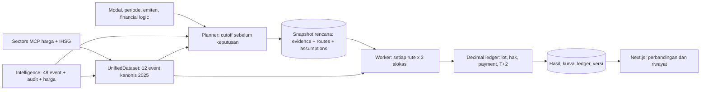

# Dividen Lab

Workspace lokal untuk riset dan replay rotasi dividen saham Indonesia. Frontend glassmorphism/dark mengikuti palette PM; backend FastAPI. **Versi awal memakai data historis Sectors, bukan harga live atau model prediksi.**

## Jalankan

Kebutuhan: Node ≥20.9, Bun, Python 3.11+. Implementasi diperiksa dengan Node25, Bun1.3.10 dan Python3.13 di macOS.

```sh
bun install --frozen-lockfile
python3 -m venv .venv
.venv/bin/python -m pip install -r backend/requirements.lock
```

Terminal backend:

```sh
.venv/bin/python -m uvicorn backend.main:app --host 127.0.0.1 --port 8000
```

Terminal frontend, preview stabil tanpa watcher:

```sh
bun run build
bun run start
```

Buka http://127.0.0.1:3000. API/OpenAPI tersedia di http://127.0.0.1:8000/docs. Untuk mengubah UI dengan hot reload, gunakan `bun run dev` sebagai pengganti `start`. Dev memakai webpack polling untuk menghindari EMFILE pada workspace campuran Python/Node.

Setup lokal checkout `horizon` pada 7 Oktober memakai npm dan Python 3.12 yang dikelola uv. Ini juga menjadi alternatif bila Python sistem gagal membuat virtualenv karena `pyexpat`/`libexpat`:

```sh
npm install --package-lock=false
/opt/homebrew/bin/uv python install 3.12
/opt/homebrew/bin/uv venv --python 3.12 .runtime/ui-feedback-venv
/opt/homebrew/bin/uv pip install --python .runtime/ui-feedback-venv/bin/python -r backend/requirements.lock
```

Jalankan backend dan frontend di dua terminal dari akar proyek:

```sh
# Terminal backend
.runtime/ui-feedback-venv/bin/python -m uvicorn backend.main:app --host 127.0.0.1 --port 8000
```

```sh
# Terminal frontend
npm run build
npm run start
```

Keduanya memakai loopback lokal. Buka http://localhost:3000/; frontend meneruskan `/api` ke backend. Snapshot yang disertakan cukup, tanpa mengambil data provider baru. Virtualenv alternatif ini tersimpan di `.runtime` yang diabaikan Git.

Untuk berbagi demo dengan perangkat di jaringan lokal yang sama, jalankan `bun run start:lan` sebagai pengganti `bun run start`. Buka `http://<IP-LAN-komputer>:3000` dari perangkat teman. Backend tetap berjalan pada127.0.0.1:8000; frontend meneruskan `/api` melalui port3000. Komputer host harus tetap menyala dan terhubung. Semua pengunjung memakai watchlist/rules/riwayat lokal yang sama karena akun terpisah belum tersedia. Hentikan proses LAN dan jalankan `bun run start` untuk kembali ke akses komputer sendiri.

Snapshot yang disertakan cukup untuk menjalankan aplikasi tanpa panggilan provider baru. `.env.local` yang sudah ada memuat kunci Sectors dan tidak boleh dicetak, disalin ke frontend, atau masuk Git. Contoh variabel tanpa rahasia ada di `.env.local.example`. Jangan menimpa file `.env.local` yang sudah berisi key.

Repository: https://github.com/YohanesVito/horizon. Pada clone baru, snapshot riset dan bukti development ikut tersedia; database `.runtime` dibuat lokal saat backend mulai berjalan. Watchlist dan riwayat simulasi pribadi dari komputer lain tidak ikut tersalin. Replay dari snapshot tidak memerlukan API key; isi konfigurasi server sendiri bila akan mengambil data Sectors baru.

## Backend Docker di Dalang

Aktif per8Oktober2026: FastAPI dalam Docker di VPS Dalang, database Supabase melalui Session Pooler. [Health backend](https://10e0ff54-f828-44de-a965-5671328a08d3.svc.dalang.io/api/health). Frontend lokal3000 sudah memakai VPS; backend lokal8000 dihentikan. Cukup jalankan frontend dengan `bun run start:lan` pada konfigurasi lokal ini. Jangan menjalankan backend kedua pada database yang sama. Frontend publik/Vercel belum dideploy. Release, bukti pengujian, kendala storage dan prosedur rollback berada di [DEPLOYMENT_DALANG.md](docs/development/DEPLOYMENT_DALANG.md).

Frontend meneruskan `/api/*` melalui Route Handler server ke `BACKEND_URL`. Untuk backend remote, URL harus HTTPS dan `HORIZON_API_KEY` harus sama pada server Next.js dan FastAPI. Jangan menggunakan awalan `NEXT_PUBLIC_` untuk key. Jika key diaktifkan, akses langsung data API/OpenAPI memerlukan header `Authorization: Bearer ...`; hanya `/api/health` terbuka. Ini proteksi antarlayanan, bukan implementasi akun pengguna. Jalankan hanya satu proses backend untuk database Supabase yang sama.

## Fitur yang dapat dicoba

**Timeline lima periode:** buka menu **Timeline → Buka pratinjau LPPF**. Bandingkan2021–2025dengan hover/fokus tahun dan modeRp/%. Tab2026memuat harga aktual sampai6Oktober2026serta panel prediksi yang belum tersedia. Katalog hanya menerima histori lengkap; sekarang belum ada emiten yang lolos seluruh verifikasi. Pratinjau LPPF terpisah dan diberi label gap data. [Runbook dan bukti pemeriksaan](docs/development/TIMELINE_IMPLEMENTATION.md).

1. **Peluang:** sembilan emiten, pencarian, sorting, filter yield/frekuensi/kelengkapan data dan aturan screening tersimpan.
2. **Detail & kalender:** 12 event kanonis tahun 2025 dari sembilan emiten yang juga ada di Intelligence; lima tahap tanggal, grafik harga setahun, riwayat dividen, null jelas.
3. **Watchlist:** tambah/hapus tersimpan di database server (Supabase atau SQLite lokal). Belum ada login/multi-user.
4. **Simulator:** modal, pilihan event, entry0/5/10 sesi sebelum cum, exit ex-close/payment-close/BEP/holding-limit. Bandingkan all-in pada event pertama, split merata, dan rotasi seluruh kas tersedia.
5. **Hasil:** grafik NAV, dividen, PnL saham, drawdown, lama modal tertahan, kesempatan terlewat, posisi terbuka, ledger, dan riwayat run persisten.
6. **Risiko:** studi delapan event BBCA 2022–2025, BEP harga dan total terpisah; tiga event belum pulih pada t+20 tetap ditampilkan.
7. **Intelligence:** audit48 event pada9 emiten2022–2025, frekuensi rugi dengan interval Wilson95%, kurva Kaplan–Meier BEP harga/total, perbandingan periode, serta ranking dengan objective dan batas risiko milik tim. Default entry5 sesi sebelum cum dan horizon20:43 event lengkap,4 dikarantina,1 tersensor dini. Studi pilot di detail memakai entry cum sehingga angkanya tidak identik.
8. **Skenario modal:** masukkan modal, harga entry, DPS dan tanggal hipotetis. Delapan analog BBCA atau analog emiten lain menghasilkan PnL/valuasi, piutang dividen, P10/median/P90 sampel, perjalanan PnL dan riwayat persisten. Ini stress test satu posisi; perubahan DPS asumsi tidak memodelkan ulang hubungan DPS dengan penurunan ex-date.

9. **Rencana rotasi:** pilih modal, periode 2025, emiten dan salinan financial logic tim. Statistik dipotong sebelum awal periode. Tiga aturan menyusun kandidat rute; audit menjelaskan event yang lolos, ditolak, atau tidak masuk rute. Uji semua rute terhadap all-in event pertama, split per event, dan rotasi kas. Tabel hasil mempunyai modal/periode sama, PnL gross, drawdown, lama modal tertahan, posisi terbuka/di bawah entry, dan kesempatan terlewat. Rencana serta replay tersimpan terpisah.

Contoh awal: Rp100 juta, BBCA→BMRI→LPPF, masuk5 sesi sebelum cum, keluar setelah sinyal BEP dengan batas20 sesi, akhir20 Mei2025. Rotasi melewatkan BMRI karena kas belum tersedia; posisi LPPF masih terbuka pada akhir replay. Hasil akhir termasuk nilai posisi dan piutang, bukan hanya uang tunai.

Katalog, kalender, dan replay kini memakai subset 12 event tahun 2025 dari sumber kanonis Intelligence (48 event 2022–2025). Harga kontinu mendukung replay sepanjang 2025; hasil lama tetap disimpan dengan versi aslinya. Belum ada forecast terkalibrasi, jadwal masa depan terkonfirmasi, atau optimizer rotasi forward. Seluruh nominal gross di luar biaya, pajak dan slippage.

### Reproduksi intelligence

Snapshot sudah tersedia; ketiga kolektor berikut hanya perlu dijalankan bila akan melengkapi cache. Tidak menyegarkan snapshot lama secara diam-diam. Restart backend setelah dataset diubah.

```sh
python3 work/collect_intelligence.py actions
python3 work/collect_intelligence.py calendar
python3 work/collect_intelligence.py prices
.venv/bin/python work/build_intelligence.py
```

74 snapshot sumber ada di `outputs/intelligence/raw/` (9 corporate actions,17 kalender,48 harga). Harga/actions lewat MCP; kalender lewat REST resmi karena tidak tersedia dalam registry66 tools MCP yang diperiksa. `baseline-analysis.json` dan `event-audit.csv` menyimpan hasil baseline; fingerprint mencakup byte snapshot serta provenance. Aturan metode ada di [INTELLIGENCE_POLICY.md](docs/development/INTELLIGENCE_POLICY.md).

API baru: `GET /api/intelligence`, `PUT /api/intelligence/rules`, `POST /api/scenarios`, `GET /api/scenarios`. Financial logic dan skenario disimpan pada database server yang dikonfigurasi. Tidak ada API key pada client atau panggilan provider dari browser.



## Data dan kalkulasi



- Harga aktual dan 12 event 2025: BBCA, BBRI, BMRI, BBNI, LPPF, DMAS, ADRO, RALS, CFIN. Cakupan harga 1 Des2024–10 Jan2026 untuk lookback/settlement; periode replay hanya tahun2025. Validasi cakupan dilakukan lagi sesuai tanggal entry dan exit pengguna.
- `work/collect_mvp_data.py` mengambil tujuh respons baru lewat **MCP Sectors**, dengan cache file; tidak meminta ulang file yang sudah ada. Jalankan `python3 work/collect_mvp_data.py` hanya saat perlu mengisi snapshot yang belum ada. Adapter MCP dan REST sebelumnya tetap berada di `work/`.
- Harga/dataset di `outputs/dividend-research/`, `outputs/sectors-live/`, `outputs/mvp-sectors/`. Raw responses mencatat tool/endpoint, arguments dan waktu pengambilan. Backend tidak mengubah raw data.
- Nilai portofolio = kas + saham + piutang hasil jual + piutang dividen. Lot100, tanpa leverage. Hasil jual tersedia T+2 **sesi teramati dataset**, dividen menjadi kas pada payment date.
- BEP harga memakai entry price. Sinyal close baru dapat dijual pada open sesi berikutnya; gap turun masih mungkin. Bila batas pengamatan tercapai, exit memakai close. Jika akhir replay lebih cepat, posisi tetap terbuka dan dinilai dengan harga terakhir.
- Durasi modal tertahan dihitung sampai settlement atau akhir pengamatan. Ini hari kalender; parameter holding memakai sesi harga setelah ex-date.
- Dividen dibukukan sebagai hak pada ex-date, kemudian pindah ke kas saat payment. Dividen tidak hilang saat saham dijual sebelum payment dan tidak dihitung dua kali.
- Semua angka **di luar biaya transaksi, pajak, dan slippage**. Tampilan uang maksimal empat desimal agar DPS pecahan tidak terlihat nol; engine menggunakan Decimal.
- Run menyimpan input, snapshot screening rules, versi engine, fingerprint dataset, ledger dan hasil. Fingerprint memungkinkan perubahan dataset terdeteksi; versi hasil lama tidak ditimpa saat aturan baru disimpan.

## Pemeriksaan development

```sh
.venv/bin/python -m pytest backend/tests -q
bun run lint
bun run typecheck
bun run build
```

Uji keuangan memakai fixture sintetis yang tidak ditampilkan sebagai data pasar, serta satu replay Sectors nyata. Uji API memakai database sementara; tidak mengubah watchlist pengguna. Pemeriksaan browser manual memverifikasi alur API–hasil, watchlist, detail, kalender dan layout. Bukti/status aktual tercatat di `docs/development/VERIFICATION.md`.

## Batas MVP saat ini

- PRD dan user story lampiran belum tersedia; implementasi mengikuti baseline percakapan. **Belum dinyatakan memenuhi seluruh PRD atau lulus UAT.** Testing akhir menunggu pembahasan dengan PM.
- Belum ada prediksi tanggal, jalur harga, probabilitas trap terkalibrasi, model lapkeu, optimizer rute global, maupun otomatisasi perdagangan. Statistik delapan event tidak menggantikan model tervalidasi.
- Belum ada declaration timestamp yang memadai atau lapkeu dengan timestamp publikasi terverifikasi. Replay bersyarat pada kalender yang diketahui saat riset; belum merupakan backtest point-in-time bebas look-ahead.
- Snapshot terbatas; kalender bukan coverage IDX lengkap. DPS berbeda basis/currency/split dan jadwal konflik tidak boleh ditambahkan ke replay tanpa validasi baru. Harga replay tidak dividend-adjusted ulang; penambahan histori memerlukan audit corporate actions.
- Penyimpanan record mendukung PostgreSQL Supabase dengan schema privat/migrasi berversi dan SQLite untuk lokal. Schema domain ternormalisasi serta autentikasi multi-user belum ada. Local-thread worker tetap bypass Redis/RQ; satu backend aktif per database cloud dijaga advisory lock. Restart menandai job yang terputus sebagai gagal agar bisa dijalankan ulang.
- Backend membaca `.env.local` otomatis; environment proses mengungguli file. `DATABASE_URL` menentukan koneksi runtime, `MIGRATION_DATABASE_URL` hanya untuk migrasi. Hosting frontend/FastAPI tetap terpisah dari database cloud. Kedua server default bind127.0.0.1; `start:lan` membuka frontend pada0.0.0.0:3000 untuk demo jaringan lokal.

Rencana dan log: [SPRINT_PLAN](docs/development/SPRINT_PLAN.md), [PROGRESS](docs/development/PROGRESS.md), [ISSUES](docs/development/ISSUES.md), [TRACEABILITY](docs/development/TRACEABILITY.md), [DESIGN](docs/development/DESIGN.md).

Konfigurasi Supabase, migrasi SQLite, pemeriksaan dan rollback: [SUPABASE_MIGRATION.md](docs/development/SUPABASE_MIGRATION.md). Migrasi hanya memindahkan record aplikasi; harga/kalender tetap snapshot Sectors di repository.

## Reproduksi dan review rencana rotasi

`python3 work/collect_rotation.py` melengkapi cache melalui MCP Sectors: 45 respons harga sembilan emiten dan 5 IHSG, semuanya interval maksimal 90 hari. Cache berada di `outputs/rotation/raw`; tidak perlu key untuk menjalankan aplikasi dengan snapshot yang sudah ada. Gap IHSG pada 2/6/7 Mei dan 20 Oktober dilengkapi hanya dari tanggal OHLCV valid yang dimiliki seluruh sembilan feed emiten. Metadata `session_repairs` dan fingerprint mencatatnya; kalender settlement resmi tetap belum diverifikasi.

API: `POST/GET /api/rotation-plans`, `GET /api/rotation-plans/{id}`, `POST /api/rotation-plans/{id}/replay`, `GET /api/rotation-runs`, `GET /api/rotation-runs/{id}`. Rencana menyimpan financial logic, cutoff, evidence IDs, alasan dan versi. Perubahan dataset mengharuskan rencana baru; hasil replay lama tetap dapat dilihat.



Metode: [ROTATION_POLICY](docs/development/ROTATION_POLICY.md). Panduan diskusi berikutnya: [PM_REVIEW](docs/development/PM_REVIEW.md). Statistik sebelum keputusan mencegah kebocoran harga/outcome dalam ranking; kalender yang belum memiliki declaration timestamp tetap asumsi. Universe dipilih setelah periode riset. Karena itu hasil belum membuktikan strategi bisa dipilih secara point-in-time pada 2025.


### Pemeriksaan kesiapan lanjutan

Jalankan `.venv/bin/python work/verify_mvp.py` untuk mengulang1.620 kombinasi replay dari snapshot lokal tanpa memanggil provider atau mengubah riwayat pengguna. Laporan tersimpan di `outputs/development/mvp-readiness.json`. Tambahan pemeriksaan backend membawa total menjadi40tes; enginev2.1 menghitung return sebelum pembulatan tampilan.

Detail emiten menyediakan tombol **Simulasikan event ini** per tanggal ex; ID itu diteruskan ke form dengan satu event terpilih. Tahun selalu ditampilkan pada timeline/settlement/payment, termasuk saat melintasi pergantian tahun. Panduan uji dan status sebenarnya ada di [TEST_MATRIX.md](docs/development/TEST_MATRIX.md); pengujian bersama PM masih menunggu pelaksanaan.
