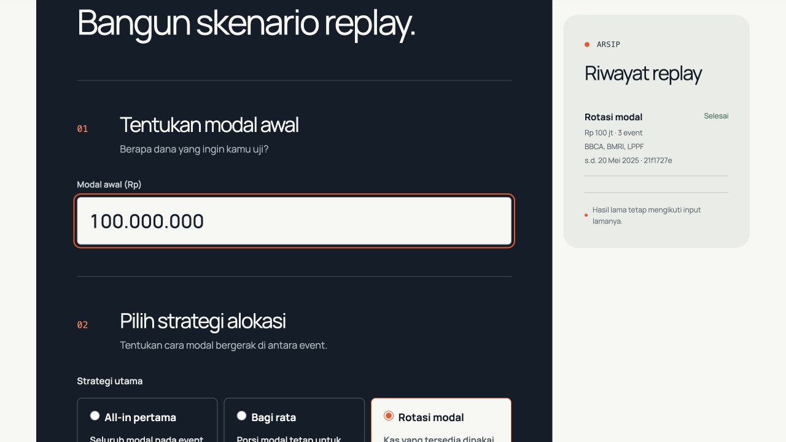
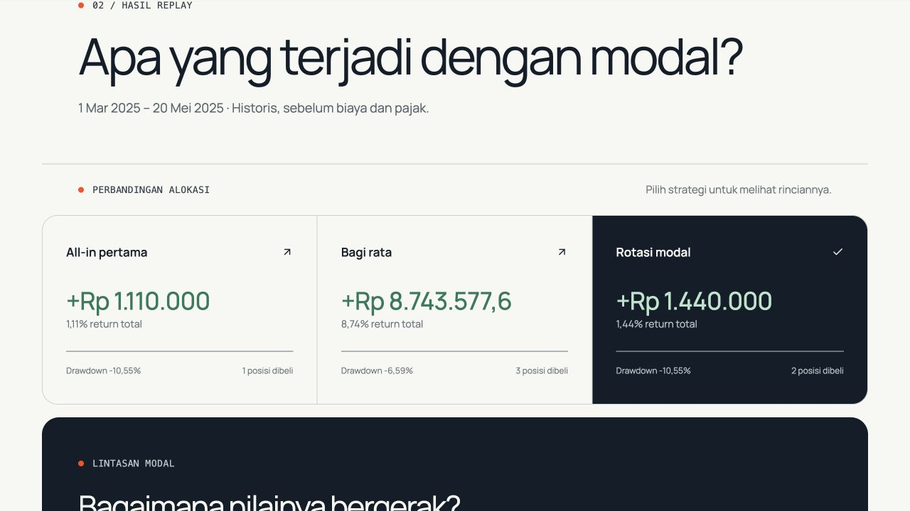
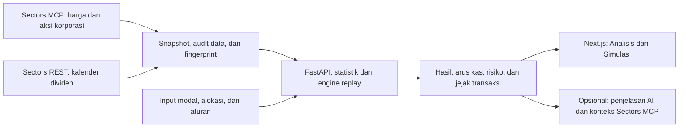

# Horizon

**Bandingkan strategi dividen, risiko harga, dan kapan modal bisa dipakai kembali.**

Horizon adalah alat analisis dan simulasi untuk investor ritel saham Indonesia yang mengejar dividen. Pengguna dapat mempelajari pergerakan harga di sekitar dividen, menguji aturan masuk–keluar, lalu membandingkan konsekuensi menaruh modal pada satu peristiwa, membaginya, atau merotasikan kas yang tersedia.

Dibangun untuk **Sectors Hackathon · Track 03: Market Intelligence**. Data finansial berasal dari Sectors. Nama yang masih tampil pada antarmuka adalah **Dividen Lab**; aplikasi tersebut adalah proyek Horizon dalam repository ini.

> Versi ini menggunakan snapshot dan replay historis. Hasilnya **di luar biaya transaksi, pajak, dan slippage**. Prediksi harga, tanggal dividen, dan probabilitas dividend trap yang tervalidasi belum tersedia. Pengguna mengambil keputusan dan mengeksekusi transaksi sendiri.

[Mulai menjalankan](#jalankan-di-komputer-sendiri) · [Coba satu simulasi](#coba-satu-simulasi) · [Cara kerja teknis](docs/TECHNICAL_GUIDE.md) · [Batas produk](#batas-produk)

## Untuk siapa dan masalah apa?

Horizon ditujukan untuk investor ritel yang ingin menguji strategi dividen sebelum menentukan penggunaan modal. Pertanyaan utamanya:

> **“Kalau saya membeli untuk menerima dividen, bagaimana hasil akhirnya setelah harga saham berubah, dan kapan modal saya tersedia untuk peluang berikutnya?”**

Besarnya dividen saja belum menjawab pertanyaan itu. Pengguna juga perlu melihat perubahan nilai saham, posisi yang belum terjual, serta kapan hasil penjualan dan dividen menjadi kas. Horizon menampilkan komponen-komponen tersebut dalam satu replay yang dapat ditelusuri.

## Yang bisa dilakukan sekarang

### 1. Pelajari harga di sekitar peristiwa dividen

Buka **Analisis**, pilih emiten, lalu bandingkan lintasan harga historis dalam rupiah atau persentase. Detail peristiwa membedakan cum-date, ex-date, recording date, dan payment date. Panel risiko menampilkan hasil historis, ukuran sampel, serta perbedaan BEP harga dan BEP termasuk dividen.


*Contoh LPPF pada preview lokal. Garis menunjukkan peristiwa historis yang tersedia, bukan jalur harga masa depan. Sumbu horizontal mengikuti urutan titik harga yang tersedia relatif terhadap ex-date; kelengkapan sesi dan basis data masih perlu verifikasi.*

### 2. Tentukan modal dan aturan simulasi

Buka **Simulasi**. Masukkan modal, pilih strategi alokasi dan peristiwa historis, lalu tentukan waktu masuk, aturan keluar, batas pengamatan, serta periode replay.

| Strategi | Cara menggunakan modal |
|---|---|
| All-in pertama | Seluruh kas yang dapat dibelanjakan diarahkan ke satu peristiwa. Form membatasi pilihan menjadi satu event. |
| Bagi rata | Anggaran awal dibagi rata per event yang dipilih. |
| Rotasi modal | Kas yang sudah tersedia digunakan untuk event berikutnya; event dapat terlewat jika kas tidak cukup. |

Jumlah saham mengikuti kelipatan 100 saham. Ketika membandingkan beberapa event, baseline all-in memakai event dengan cum-date pertama.



*Modal Rp100 juta adalah input contoh untuk demonstrasi, bukan modal yang disarankan.*

### 3. Bandingkan hasil dan baca penyebab perbedaannya

Hasil replay menampilkan perubahan nilai portofolio, dividen, untung/rugi saham, penurunan maksimum, posisi terbuka, dan waktu modal tertahan. Pilih kartu alokasi untuk membaca rincian strategi tersebut. Jejak transaksi memperlihatkan pembelian, penjualan, hak dividen, pembayaran, dan settlement.



*Screenshot berasal dari replay contoh di bawah. Angka positif bukan bukti strategi akan menguntungkan pada periode berikutnya. Nilai akhir dapat mencakup saham yang masih dipegang dan piutang.*

Ringkasan AI dapat membantu menjelaskan hasil serta konteks Sectors ketika kredensial server tersedia. Angka replay dihitung oleh engine Python. AI tidak menentukan hasil perhitungan dan tidak wajib tersedia untuk menjalankan simulator.

## Coba satu simulasi

Setelah aplikasi berjalan, buka **Simulasi** dan gunakan input berikut. Pemilihan emiten pada Analisis belum otomatis diteruskan ke form; periksa kembali event yang dipilih.

| Input | Nilai contoh |
|---|---|
| Modal | Rp100.000.000 |
| Strategi utama | Rotasi modal |
| Event | BBCA 21 Maret 2025, BMRI 14 April 2025, LPPF 22 April 2025 — tanggal ex-date |
| Waktu masuk | 5 hari bursa sebelum cum-date |
| Aturan keluar | Setelah sinyal BEP harga |
| Batas pengamatan | 20 hari bursa setelah ex-date |
| Periode | 1 Maret–20 Mei 2025 |

Klik **Lihat hasil replay**. Dengan snapshot pada commit `8a8b5a6`, hasil yang diverifikasi adalah:

| Alokasi | Nilai portofolio akhir | Untung/rugi gross | Penurunan maksimum |
|---|---:|---:|---:|
| All-in pertama | Rp101.110.000 | +Rp1.110.000 | −10,5450% |
| Bagi rata | Rp108.743.577,60 | +Rp8.743.577,60 | −6,5870% |
| Rotasi modal | Rp101.440.000 | +Rp1.440.000 | −10,5450% |

Pada rotasi, **BMRI terlewat karena kas tidak cukup tersedia pada tanggal masuk**. LPPF masih dipegang pada akhir replay. Nilai portofolio Rp101.440.000 terdiri dari kas Rp98.545.000 dan saham Rp2.895.000; bukan seluruhnya uang tunai.

Ubah aturan keluar, lalu jalankan lagi untuk melihat konsekuensinya. Contoh ini menjelaskan hubungan aturan, arus kas, dan hasil; tidak menetapkan strategi terbaik untuk semua saham atau periode. [Bukti input dan hasil](outputs/development/readme-walkthrough.json).

## Bagaimana Sectors menjadi insight?



Engine menghitung nilai portofolio sebagai **kas + nilai saham + piutang hasil jual + piutang dividen**. Hak dividen terpisah dari tanggal pembayaran; hasil jual baru dapat dipakai setelah settlement. Dengan demikian, dividen yang belum dibayar tidak langsung dianggap modal untuk membeli saham lain.

Repository juga memuat ranking berdasarkan logika tim, statistik Wilson/Kaplan–Meier, skenario analog, dan planner rute. Modul-modul itu tersedia dalam kode/API, tetapi **tidak ditawarkan sebagai menu utama pada demo dua halaman saat ini**. Peta modul, endpoint, metode, dan tes ada di [panduan teknis](docs/TECHNICAL_GUIDE.md).

## Jalankan di komputer sendiri

Kebutuhan: **Node.js ≥20.9, Bun, dan Python ≥3.11**. Jalankan perintah dari akar repository. Snapshot Sectors sudah disertakan; replay dasar tidak memerlukan API key atau koneksi ke Supabase.

```sh
git clone https://github.com/YohanesVito/horizon.git
cd horizon
bun install --frozen-lockfile
python3 -m venv .venv
.venv/bin/python -m pip install -r backend/requirements.lock
mkdir -p .runtime
```

**Terminal 1 — backend lokal dengan database demo terpisah:**

```sh
DATABASE_URL=sqlite:///.runtime/readme-demo.db \
HORIZON_API_KEY='' HORIZON_REQUIRE_API_KEY=0 AI_KEY='' SECTORS_API_KEY='' \
.venv/bin/python -m uvicorn backend.main:app --host 127.0.0.1 --port 8000
```

**Terminal 2 — frontend:**

```sh
bun run build
BACKEND_URL=http://127.0.0.1:8000 HORIZON_API_KEY='' bun run start
```

Buka **http://127.0.0.1:3000**. Dokumentasi API lokal tersedia di **http://127.0.0.1:8000/docs**. Perintah di atas memakai SQLite lokal dan menonaktifkan panggilan AI/provider baru, termasuk jika checkout memiliki `.env.local` untuk cloud. Bila port sudah dipakai, pilih port kosong untuk kedua server dan sesuaikan `BACKEND_URL`.

Untuk mengaktifkan penjelasan AI atau mengumpulkan snapshot baru, ikuti [konfigurasi server dan panduan teknis](docs/TECHNICAL_GUIDE.md#konfigurasi-dan-operasi). Jangan menaruh key dalam variabel `NEXT_PUBLIC_*` atau commit. Riwayat demo tersimpan lokal; akun dan data pribadi antar-pengguna belum dipisahkan.

## Pemeriksaan

```sh
.venv/bin/python -m pytest backend/tests -q
bun run lint
bun run typecheck
bun run build
```

Pada source `8a8b5a6` (8 Oktober 2026): **138 tes backend, lint, TypeScript, dan build produksi lulus**. Tes backend juga lulus dari ekspor file Git bersih menggunakan lingkungan dependensi yang sudah terpasang. Satu warning deprecation Starlette tercatat. Ini pemeriksaan development, bukan bukti akurasi prediksi atau kelulusan UAT.

Screenshot di README diambil dari aplikasi lokal dengan database terpisah, melalui alur browser Analisis → Simulasi → hasil. [Asal screenshot dan bukti](docs/images/README.md).

## Batas produk

- **Historis dan cakupan terbatas.** Analisis menampilkan lima kandidat; engine replay mencakup 12 event tahun 2025 pada sembilan emiten. Dataset intelligence mencakup 48 event 2022–2025 sebelum penyaringan. Cakupan tersebut bukan seluruh IDX atau kalender dividen terkini.
- **Statistik belum menjadi prediksi tervalidasi.** Timeline masih pratinjau; gap tahun, konflik jadwal, dan kesetaraan basis harga/dividen belum seluruhnya selesai diaudit. Sampel kecil dan emiten terpilih membatasi generalisasi.
- **BEP harga berbeda dari BEP total.** BEP harga berarti harga mencapai harga beli. BEP total juga memperhitungkan dividen. Sinyal BEP pada close dieksekusi pada open berikutnya sehingga harga jual masih bisa di bawah harga beli.
- **Asumsi replay tetap penting.** Biaya, pajak, dan slippage belum dihitung. Kalender settlement mengikuti sesi dataset; timestamp pengumuman belum memadai untuk membuktikan seluruh informasi tersedia pada tanggal keputusan historis.
- **Masih MVP.** Belum ada akun terpisah, optimizer rute global, atau eksekusi order. Pekerjaan background memakai thread lokal; proses yang terputus perlu dijalankan ulang. Pengujian penerimaan bersama PM belum dinyatakan selesai.

## Dokumentasi lanjutan

- [Panduan teknis: modul, metode, data, dan operasi](docs/TECHNICAL_GUIDE.md)
- [Metode statistik risiko](docs/development/INTELLIGENCE_POLICY.md) dan [metode rotasi](docs/development/ROTATION_POLICY.md)
- [Kontrak dan batas analisis AI](docs/development/AI_INSIGHTS.md)
- [Progres development](docs/development/PROGRESS.md), [issue dan gap](docs/development/ISSUES.md), serta [pemetaan kebutuhan](docs/development/TRACEABILITY.md)
- [Panduan pengujian bersama PM](docs/development/UAT_SESSION.md)
