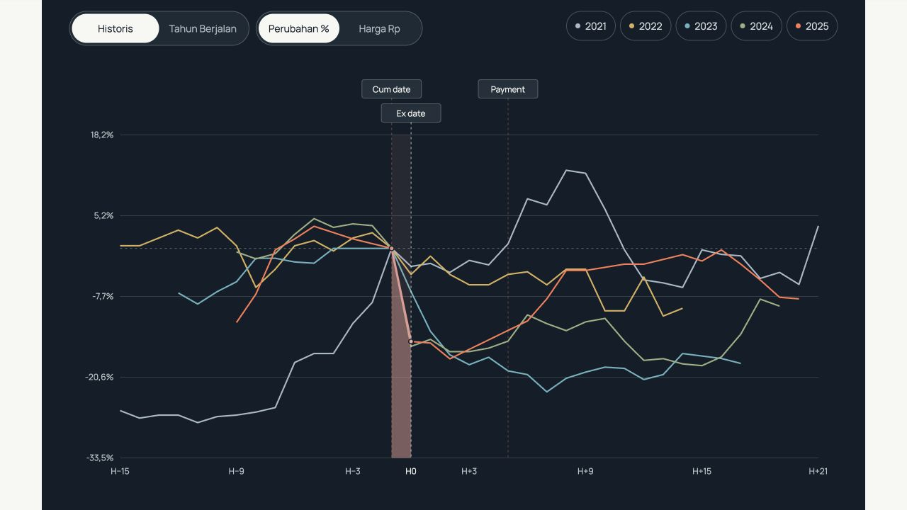
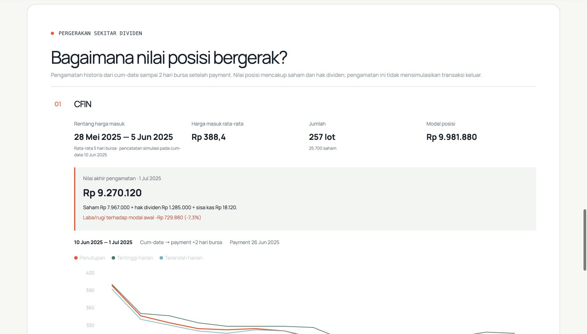
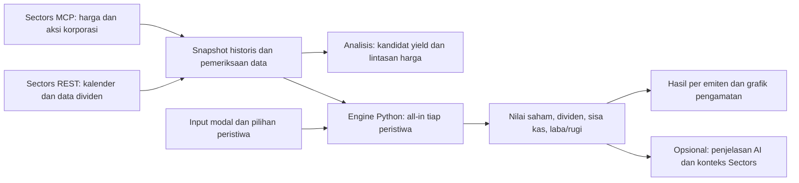

# Horizon

**Lihat apakah dividen menutup penurunan harga saham.**

Horizon adalah alat analisis dan simulasi untuk investor ritel saham Indonesia yang mengejar dividen. Pengguna mempelajari harga di sekitar dividen dan menguji seluruh modal pada tiap peristiwa secara independen. Hasil memperlihatkan nilai saham, dividen, sisa kas, serta laba/rugi historis sampai dua hari bursa setelah pembayaran.

Dibangun untuk **Sectors Hackathon · Track 03: Market Intelligence**. Data finansial berasal dari Sectors.

> Versi ini menggunakan snapshot dan replay historis. Hasilnya **di luar biaya transaksi, pajak, dan slippage**. Prediksi harga, tanggal dividen, dan probabilitas dividend trap yang tervalidasi belum tersedia. Pengguna mengambil keputusan dan mengeksekusi transaksi sendiri.

[Mulai menjalankan](#jalankan-di-komputer-sendiri) · [Coba satu simulasi](#coba-satu-simulasi) · [Cara kerja teknis](docs/TECHNICAL_GUIDE.md) · [Batas produk](#batas-produk)

## Untuk siapa dan masalah apa?

**Problem Statement:**

Investor ritel pemburu dividen (Dividend Hunter) kesulitan membandingkan strategi penggunaan modal karena yield saja tidak menunjukkan potensi kerugian harga saham dan berapa lama modal tertahan sebelum bisa digunakan kembali.

## Yang bisa dilakukan sekarang

### 1. Pelajari harga di sekitar peristiwa dividen

Buka **Analisis**, pilih emiten, lalu bandingkan lintasan harga historis dalam rupiah atau persentase. Detail peristiwa membedakan cum-date, ex-date, recording date, dan payment date. Panel risiko menampilkan hasil historis, ukuran sampel, serta perbedaan BEP harga dan BEP termasuk dividen.



*Contoh LPPF pada preview lokal. Garis menunjukkan peristiwa historis yang tersedia, bukan jalur harga masa depan. Sumbu horizontal mengikuti urutan titik harga yang tersedia relatif terhadap ex-date; kelengkapan sesi dan basis data masih perlu verifikasi.*

### 2. Tentukan modal dan peristiwa simulasi

Buka **Simulasi**, masukkan modal, lalu pilih 1–10 peristiwa dividen. Klik **Simulasikan**; saat proses berlangsung tombol menampilkan **Menjalankan simulasi…**.

Simulasi memakai **all-in tiap peristiwa**: seluruh modal awal yang sama diuji secara independen pada setiap peristiwa, dengan pembelian dalam kelipatan 100 saham. Sisa dana tetap menjadi kas. Jika memilih beberapa peristiwa, hasilnya dibandingkan satu per satu, tidak dijumlahkan menjadi satu portofolio. Form saat ini tidak menawarkan bagi rata atau rotasi modal.

Buka **Bagaimana simulasi dihitung?** untuk melihat aturan tetap: harga masuk adalah rata-rata lima harga penutupan hari bursa sebelum cum-date, tidak termasuk cum-date. Pengamatan berlangsung dari cum-date hingga dua hari bursa setelah payment; tidak ada transaksi keluar. Tanggal pengamatan ditentukan otomatis dan data yang belum lengkap ditandai parsial.

### 3. Bandingkan hasil tiap peristiwa dan pahami komponennya

Setiap kartu emiten menampilkan harga masuk rata-rata, jumlah lot/saham, modal posisi, serta nilai akhir pengamatan. Nilai akhir terdiri dari **nilai saham + hak dividen + sisa kas**. Laba/rugi membandingkan nilai akhir tersebut dengan modal awal.

Grafik memperlihatkan harga selama pengamatan. Nilai posisi tertinggi/terendah memakai harga high/low historis ditambah dividen hipotetis dan tidak memasukkan sisa kas. Angka ekstrem ini berbeda dari nilai akhir portofolio dan bukan harga jual yang dijamin.



*Contoh CFIN, ex-date 11 Juni 2025. Hasil diamati sampai 1 Juli 2025. Posisi tidak dijual; laba/rugi merupakan valuasi historis di luar biaya transaksi, pajak, dan slippage.*

Buka **Ringkasan AI · [ticker]** untuk penjelasan hasil dan konteks ketika layanan tersedia. Angka dihitung engine Python; AI membantu menjelaskan, bukan menentukan hasil atau menjamin penyebab perubahan harga.

## Coba satu simulasi

Di [web Horizon](https://horizon-dividend.vercel.app/), buka **Simulasi**, kosongkan pilihan BBCA bawaan, lalu pilih hanya CFIN dan masukkan modal berikut. Skenario ini juga menjadi acuan demo video.

| Input / aturan otomatis | Nilai |
|---|---|
| Modal | Rp10.000.000 |
| Peristiwa | CFIN — ex-date 11 Juni 2025 |
| Alokasi | All-in pada satu peristiwa |
| Referensi harga masuk | Rata-rata lima close, 28 Mei–5 Juni 2025: Rp388,40 |
| Cum-date | 10 Juni 2025 |
| Payment | 26 Juni 2025 |
| Akhir pengamatan | 1 Juli 2025 — payment +2 hari bursa |

Klik **Simulasikan**. Run live `7768ae04-704b-4163-96ab-9a966bdfb8f1`, diperiksa 8 Oktober 2026, menghasilkan:

| Komponen | Nilai |
|---|---:|
| Jumlah saham | 25.700 saham / 257 lot |
| Modal posisi | Rp9.981.880 |
| Sisa kas | Rp18.120 |
| Dividen per saham | Rp50 |
| Total dividen | Rp1.285.000 |
| Harga akhir pengamatan | Rp310 |
| Nilai saham akhir | Rp7.967.000 |
| Perubahan nilai saham dari harga masuk | −Rp2.014.880 |
| Nilai akhir termasuk dividen dan kas | **Rp9.270.120** |
| Laba/rugi terhadap modal awal | **−Rp729.880 (−7,30%)** |

**Dividen Rp1.285.000 belum menutup penurunan nilai saham Rp2.014.880.** Ini contoh mengapa yield saja belum cukup untuk menilai hasil. Nilai akhir bukan seluruhnya kas karena saham masih dipegang.

Pada Analisis, CFIN berada di peringkat empat kandidat yield historis 2025 dengan **15,94%**. Angka itu adalah yield pada daftar kandidat, bukan return simulasi. Close cum-date Rp398 turun menjadi Rp346 pada ex-date: **−Rp52 (−13,07%)**. Penurunan satu hari ini berbeda dari perubahan nilai saham sepanjang simulasi yang memakai harga masuk rata-rata Rp388,40.

[Bukti run dan rekonsiliasi angka](outputs/development/cfin-demo-20261008.json). Ubah modal atau peristiwa untuk menguji skenario lain. Contoh ini dipilih untuk menunjukkan risiko; bukan rekomendasi saham atau hasil yang mewakili semua peristiwa.

## Bagaimana Sectors menjadi insight?



Sectors menyediakan data harga dan dividen yang menjadi dasar analisis. Engine menentukan jumlah lot dari modal dan harga masuk rata-rata, menghitung nilai saham selama pengamatan, lalu menambahkan hak dividen dan sisa kas untuk nilai akhir. Setiap peristiwa memakai modal penuh secara independen; tidak ada perpindahan kas antarperistiwa atau penjualan otomatis dalam alur ini.

AI membantu membaca hasil dan menelusuri konteks tambahan ketika tersedia. Statistik, konteks bersumber, dan dugaan penyebab harus dibedakan. Data atau berita yang berdekatan waktunya tidak membuktikan kausalitas; hasil historis bukan prediksi.

Kode/API dan arsip hasil masih memuat simulasi tiga alokasi, aturan keluar, settlement, planner rute, dan eksperimen prediksi. Itu bukan pilihan pada form Simulasi saat ini. Peta modul dan metode tersedia di [panduan teknis](docs/TECHNICAL_GUIDE.md); angka contoh lama tetap disimpan sebagai bukti historis.

## Jalankan di komputer sendiri

Kebutuhan: **Node.js ≥20.9, Bun, dan Python ≥3.11**. Jalankan perintah dari akar repository. Snapshot Sectors sudah disertakan; replay dasar tidak memerlukan API key atau koneksi ke Supabase.

```sh
git clone https://github.com/YohanesVito/horizon.git
cd horizon
bun install --frozen-lockfile
python3 -m venv .venv
.venv/bin/python -m pip install -r backend/requirements.lock
mkdir -p .runtime
```

**Terminal 1 — backend lokal dengan database demo terpisah:**

```sh
DATABASE_URL=sqlite:///.runtime/readme-demo.db \
HORIZON_API_KEY='' HORIZON_REQUIRE_API_KEY=0 AI_KEY='' SECTORS_API_KEY='' \
.venv/bin/python -m uvicorn backend.main:app --host 127.0.0.1 --port 8000
```

**Terminal 2 — frontend:**

```sh
bun run build
BACKEND_URL=http://127.0.0.1:8000 HORIZON_API_KEY='' bun run start
```

Buka **http://127.0.0.1:3000**. Dokumentasi API lokal tersedia di **http://127.0.0.1:8000/docs**. Perintah di atas memakai SQLite lokal dan menonaktifkan panggilan AI/provider baru, termasuk jika checkout memiliki `.env.local` untuk cloud. Bila port sudah dipakai, pilih port kosong untuk kedua server dan sesuaikan `BACKEND_URL`.

Untuk mengaktifkan penjelasan AI atau mengumpulkan snapshot baru, ikuti [konfigurasi server dan panduan teknis](docs/TECHNICAL_GUIDE.md#konfigurasi-dan-operasi). Jangan menaruh key dalam variabel `NEXT_PUBLIC_*` atau commit. Riwayat demo tersimpan lokal; akun dan data pribadi antar-pengguna belum dipisahkan.

## Pemeriksaan

```sh
.venv/bin/python -m pytest backend/tests -q
bun run lint
bun run typecheck
bun run build
```

Pada source `8a8b5a6` (8 Oktober 2026): **138 tes backend, lint, TypeScript, dan build produksi lulus**. Tes backend juga lulus dari ekspor file Git bersih menggunakan lingkungan dependensi yang sudah terpasang. Satu warning deprecation Starlette tercatat. Ini pemeriksaan development, bukan bukti akurasi prediksi atau kelulusan UAT.

Screenshot Analisis berasal dari preview lokal terdahulu; screenshot CFIN berasal dari web publik pada 8 Oktober 2026. [Asal screenshot dan bukti](docs/images/README.md).

## Batas produk

- **Historis dan cakupan terbatas.** Analisis menampilkan lima kandidat; engine replay mencakup 12 event tahun 2025 pada sembilan emiten. Dataset intelligence mencakup 48 event 2022–2025 sebelum penyaringan. Cakupan tersebut bukan seluruh IDX atau kalender dividen terkini.
- **Statistik belum menjadi prediksi tervalidasi.** Timeline masih pratinjau; gap tahun, konflik jadwal, dan kesetaraan basis harga/dividen belum seluruhnya selesai diaudit. Sampel kecil dan emiten terpilih membatasi generalisasi.
- **BEP harga berbeda dari BEP total.** BEP harga berarti harga mencapai harga beli. BEP total memperhitungkan dividen. Alur simulasi saat ini tidak menjual pada sinyal BEP.
- **Asumsi simulasi tetap penting.** Biaya, pajak, dan slippage belum dihitung. Harga masuk rata-rata lima close adalah referensi, bukan harga eksekusi pada satu tanggal. Akhir pengamatan bukan tanggal modal otomatis kembali menjadi kas; tidak ada penjualan atau settlement dalam alur ini. Timestamp pengumuman belum memadai untuk membuktikan seluruh informasi tersedia saat keputusan historis.
- **Masih MVP.** Belum ada akun terpisah, optimizer rute global, atau eksekusi order. Pekerjaan background memakai thread lokal; proses yang terputus perlu dijalankan ulang. Pengujian penerimaan bersama PM belum dinyatakan selesai.

## Dokumentasi lanjutan

- [Panduan teknis: modul, metode, data, dan operasi](docs/TECHNICAL_GUIDE.md)
- [Metode statistik risiko](docs/development/INTELLIGENCE_POLICY.md) dan [metode rotasi](docs/development/ROTATION_POLICY.md)
- [Kontrak dan batas analisis AI](docs/development/AI_INSIGHTS.md)
- [Progres development](docs/development/PROGRESS.md), [issue dan gap](docs/development/ISSUES.md), serta [pemetaan kebutuhan](docs/development/TRACEABILITY.md)
- [Panduan pengujian bersama PM](docs/development/UAT_SESSION.md)
