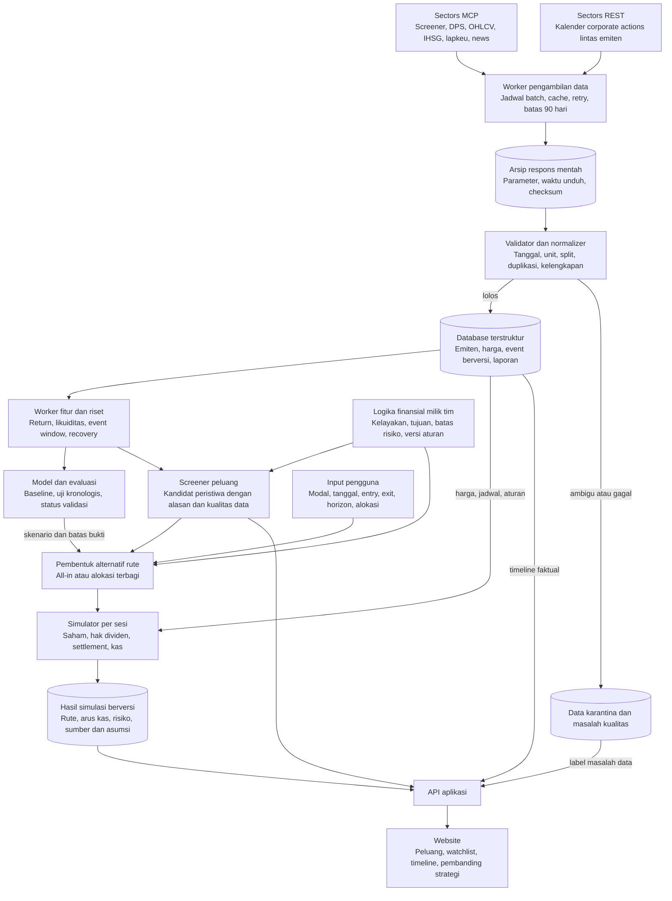
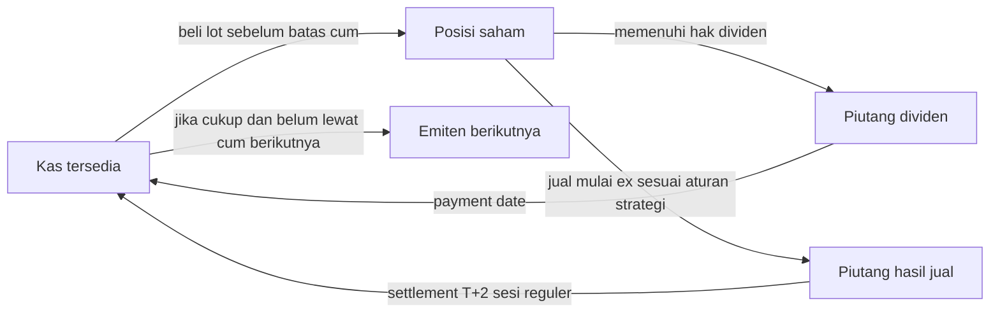

# Arsitektur simulator rotasi dividen

Rancangan untuk retail Indonesia yang ingin membandingkan pendapatan dividen, perubahan nilai saham, dan waktu modal tertahan. Sumber data finansial: Sectors. Produk membantu keputusan; pengguna mengeksekusi order sendiri. Status 6 Oktober 2026: pengambilan data dan studi BBCA telah berjalan sebagai skrip riset; komponen aplikasi di bawah masih rancangan.

**Semua simulasi versi awal di luar biaya transaksi, pajak dan slippage.** Ketiga komponen tetap ada dalam kontrak input dengan nilai nol agar hasil dapat direproduksi dan ruang lingkupnya terbaca.

## Alur dari sumber sampai layar

Untuk MVP, komponen tersebut dapat berupa satu backend modular dan satu proses worker dengan PostgreSQL serta penyimpanan berkas mentah. Pemisahan fungsi tidak mengharuskan banyak microservice. API key Sectors hanya berada di backend. Frontend membaca API aplikasi; angka proyeksi bukan hasil karangan model bahasa.

## Tanggung jawab setiap proses

| Urutan | Input dan asal | Yang memproses | Tahap kerja | Output dan penyimpanan | Tempat pengguna melihatnya |
|---|---|---|---|---|---|
| 1 | Universe/screener dan kalender Sectors | Worker pengambilan | Ambil data dengan parameter eksplisit; batasi request dan simpan respons sebelum diubah | Raw snapshots dan ingestion log | Waktu pembaruan pada kartu data |
| 2 | Raw snapshots | Validator | Periksa schema, urutan tanggal, unit mata uang, duplikasi, OHLC, basis split, missing field dan revisi | Data lolos; daftar masalah dan data karantina | Label tersedia, estimasi, konflik atau belum diketahui |
| 3 | Data lolos | Normalizer | Hubungkan simbol ke ID emiten; identifikasi event; simpan versi tanpa menghapus versi lama | Canonical database | Timeline emiten dan histori |
| 4 | Harga, DPS, benchmark dan laporan as-of | Worker fitur | Bentuk window event, yield pada harga masuk, likuiditas, return harga/total, status pemulihan | Feature set dengan tanggal ketersediaan | Statistik historis dan jumlah sampel |
| 5 | Fitur dan target pada data pelatihan | Worker riset/model | Bandingkan baseline; pisahkan waktu latih/uji; cek kalibrasi dan pola kegagalan | Model version, metrik validasi, skenario harga dan waktu | Proyeksi beserta batas bukti; disembunyikan jika belum layak |
| 6 | Event, fitur dan aturan tim | Screener | Terapkan syarat kelayakan dan urutan yang dapat dijelaskan | Candidate events, alasan masuk/keluar | Halaman Peluang dan filter watchlist |
| 7 | Kandidat, modal dan aturan pengguna | Pembentuk rute | Susun alternatif all-in atau split; periksa timeline tumpang tindih dan batas konsentrasi | Proposed routes, bukan klaim rute optimum global | Strategy builder |
| 8 | Rute, harga skenario, jadwal dan aturan pasar | Simulator | Jalankan setiap sesi; alokasikan lot, hak dividen, piutang, settlement, kas; lewati transaksi tidak layak | Ledger dan lintasan nilai portofolio setiap skenario | Timeline modal, kas dan posisi |
| 9 | Hasil semua alternatif | Pembanding strategi | Bandingkan pada modal/tanggal akhir sama; ukur hasil, kerugian dan waktu kas tertahan | Result set dengan peringkat sesuai tujuan/batas risiko | Pembanding strategi dan penjelasan rute |
| 10 | Data/run/model/rules versions | API aplikasi | Sajikan hasil yang konsisten dan dapat ditelusuri; invalidasi ketika input berubah | Respons API dan cached view | Semua halaman |

Pemilik keputusan: PM menetapkan segmen, tujuan dan batas produk; tim riset menetapkan hipotesis serta evaluasi; data engineer menjaga makna/provenance data; backend menjalankan kalkulasi deterministik; frontend menampilkan asumsi dan hasil. LLM opsional hanya untuk mengekstrak kandidat informasi berita yang harus diverifikasi atau menjelaskan angka yang sudah dihitung.

## Kontrak data minimum

| Entitas | Kolom inti | Invarian penting |
|---|---|---|
| `issuers` | ID internal, ticker, nama, sektor, periode listing, alias ticker | Perubahan ticker tidak membuat sejarah emiten baru secara diam-diam |
| `raw_snapshots` | source, transport/tool/URL, arguments, retrieved_at, hash, payload_path | Tidak menyimpan API key; respons mentah tidak ditimpa |
| `dividend_event_versions` | event_id, version, issuer, DPS, currency, declaration_at, cum/ex/record/payment, market_type, status, known_at, retrieved_at, source_id | Null bukan nol; current snapshot tidak membuktikan historical known_at |
| `price_bars` | issuer, date, OHLCV, currency, adjustment_basis, source_id | Split adjustment harga harus konsisten dengan saham dan DPS |
| `corporate_actions` | issuer, type, effective_date, ratio, version, source_id | Aksi modal mengubah saham/harga/hak secara konsisten |
| `financial_report_versions` | period_end, published_at, version, metrics, currency, source_id | Fitur backtest hanya dapat dipakai jika published_at sudah lewat |
| `market_sessions_rules` | tanggal/sesi, status buka, jenis pasar, lot, fraksi, settlement rule, effective_from/to, source | Weekend saja tidak cukup menentukan hari bursa |
| `quality_issues` | entity_id, issue_type, severity, evidence, resolution | Konflik material menghalangi kalkulasi yang bergantung padanya |
| `feature_sets` | event_id, as_of, horizon, values, missing_flags, source_versions | Tidak boleh menyertakan informasi setelah tanggal keputusan |
| `rules_model_versions` | tujuan, filter, batas risiko, parameter, pelatihan, validasi, status | Hasil eksperimen dan model lolos validasi dibedakan |
| `simulation_runs` | modal, periode, allocation, entry/exit, horizon, costs=0, data/model/rules versions | Input lengkap tersimpan agar hasil dapat diulang |
| `simulation_ledger` | tanggal, posisi, settled_cash, sale_receivable, dividend_receivable, NAV, event/action | Dana dan hak tidak terhitung dua kali |

Identitas event sebaiknya memakai ID stabil dari penyedia jika tersedia. Kombinasi ticker dan ex-date hanya kunci pencocokan awal: revisi tanggal bisa mengubah kunci tersebut, dan dua distribusi berbeda bisa terjadi berdekatan. Deduplikasi `dividend` versus `upcoming_dividend` harus mempertahankan bukti asal dan riwayat perubahan.

## Kehidupan modal dalam satu event

Panah dari posisi ke piutang dividen tidak berarti saham hilang: posisi tetap ada sampai dijual. Ketika dijual, hak dividen yang telah diperoleh tetap dicatat. Harga ex yang lebih rendah mempengaruhi nilai posisi; dividen belum bisa dipakai membeli saham lain sampai menjadi kas.

Model awal menahan hasil jual sampai settlement sebagai asumsi tanpa kredit broker. Buying power real dapat berbeda; jangan menjadikannya klaim bahwa semua broker melarang reinvestasi sebelum T+2. Jika kelak mendukung buying power, aturan dan kewajiban settlement harus diubah secara eksplisit.

Rute adalah rangkaian keputusan bersyarat. Contoh: bila A belum mencapai aturan keluar sebelum batas membeli B, simulator harus menampilkan pilihan tetap di A atau melewatkan B; ia tidak boleh memakai modal A dua kali. Portofolio dengan beberapa saham harus mempertahankan korelasi pasar dalam skenario, bukan menggabungkan hari terbaik tiap saham secara independen.

## Tempat logika finansial milik tim berada

Logika tim dipisah menjadi empat bagian agar dapat diuji dan direvisi:

1. **Kelayakan:** sumber/tanggal/unit valid, event belum lewat batas masuk, modal cukup untuk lot, dan saham dapat diperdagangkan. Syarat data tidak dapat dinonaktifkan hanya untuk menaikkan hasil.
2. **Hipotesis:** kapan masuk/keluar, kelompok sektor atau interim/final, fitur yang dianggap relevan. Setiap versi punya alasan dan hasil uji.
3. **Tujuan:** memaksimalkan kekayaan gross pada tanggal akhir yang sama, dengan laporan kas dan posisi tersisa. Ranking perusahaan hanyalah tahap kandidat; ranking rute menjawab penggunaan modal.
4. **Batas risiko:** konsentrasi, maksimum waktu menunggu, kerugian yang dapat diterima, dan likuiditas. Nilainya dipilih pengguna/tim dan perlu diuji, bukan diciptakan sebagai bobot ajaib.

Jika batas risiko belum diputuskan, tampilkan beberapa alternatif yang saling bertukar antara potensi hasil dan risiko. Jangan menyembunyikan preferensi itu dalam satu skor "terbaik". Tampilkan alasan: berapa tambahan hasil yang diproyeksikan, dengan tambahan risiko dan durasi berapa.

Peluang trap bersyarat pada entry/exit/horizon. Waktu pulih adalah distribusi dengan observasi tersensor. Jadwal yang belum diumumkan adalah estimasi terpisah; estimasi tanggal jangan dipakai menentukan hak dividen secara pasti. Bila data tidak cukup, output "belum cukup data" tetap merupakan hasil produk yang sah.

## Proses pembaruan dan validasi

Rancangan pembaruan: harga setelah sesi perdagangan; kalender/berita sesuai kuota dan kebutuhan; laporan ketika periode/versi baru tersedia. Ini spesifikasi sistem, belum otomasi yang diaktifkan. Event yang direvisi menginvalidasi kandidat, forecast dan rute terkait; hasil historis lama tetap tersimpan dengan versinya.

Pengawas revisi membandingkan kalender dengan berita/filings dari Sectors. Pada audit ini kalender UNTR/ASGR masih memuat jadwal lama, sementara berita Sectors memuat perubahan. Konflik tersebut harus membekukan penggunaan event dalam rute sampai terkonfirmasi. Berita paling baru bukan otomatis paling benar; versi pengumuman resmi dan maknanya perlu ditelusuri. Bila model bahasa membantu ekstraksi, hasilnya adalah kandidat revisi dengan tautan bukti untuk pemeriksaan, bukan perubahan jadwal tanpa verifikasi.

Validasi sebelum fitur prediksi ditampilkan: uji kronologis, baseline yang transparan, pemisahan event dengan window tumpang tindih, kontrol jumlah variasi strategi, dan pemeriksaan kalibrasi. Gunakan universe yang mencakup delisting/suspensi jika mengklaim kinerja lintas pasar. Model diuji per event, bukan memperlakukan ratusan harga dalam dua event sebagai ratusan eksperimen independen.

Untuk uji simulator, kasus penting adalah konservasi kas/NAV, transaksi lot, batas cum, dividen setelah saham terjual, libur bursa dan T+2, jadwal direvisi, split, posisi gagal pulih, serta pemilihan rute ketika dana belum tersedia. Grafik prediksi saja tidak membuktikan simulator benar.

## Tahap pembangunan yang disarankan

| Tahap | Hasil yang dibangun | Syarat untuk lanjut |
|---|---|---|
| 1 | Arsip data, validator, kalender, discovery, kualitas data | Tanggal/unit/pasar event yang ditampilkan dapat dijelaskan |
| 2 | Replay satu emiten dan ledger deterministik | Hak, saham, piutang dan kas konsisten pada kasus uji |
| 3 | Pembanding all-in dan alokasi terbagi dengan skenario manual/historis | Semua rute memakai modal nyata yang tersedia dan horizon sama |
| 4 | Model rentang harga, recovery dan jadwal | Bukti uji baru memadai dan kalibrasi dilaporkan |
| 5 | Pencarian rute berdasarkan proyeksi yang lolos validasi | Keunggulan dan pola gagal diuji terhadap baseline sederhana |

Tahap 1–3 sudah bisa menguji manfaat produk tanpa mengklaim kemampuan memprediksi pasar. [Resource riset dan bukti Sectors](./riset-dividen.md) memuat temuan numerik, sumber, data yang masih hilang, dan skrip reproduksi.
