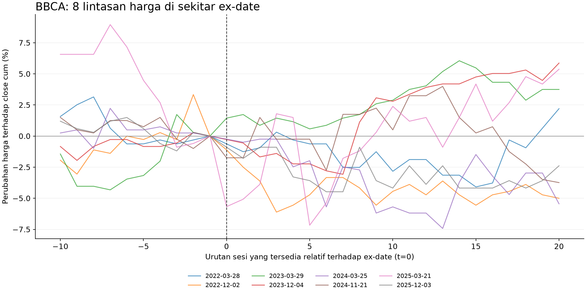
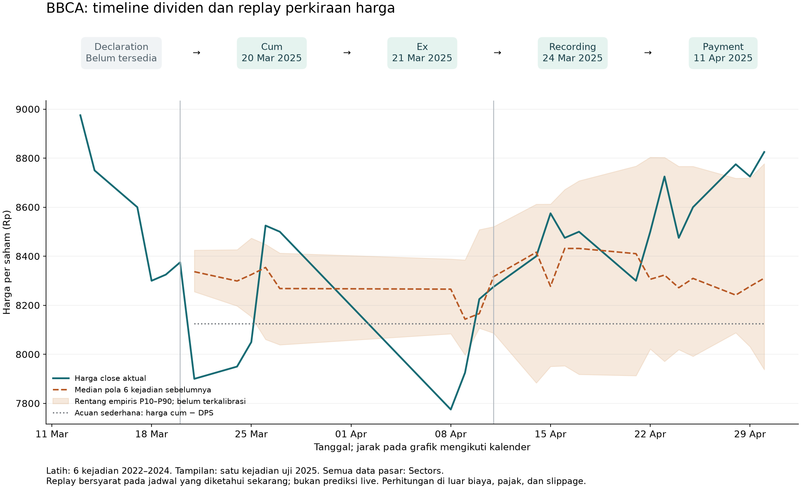

# Riset data dan logika simulator rotasi dividen

Audit 6 Oktober 2026, Asia/Makassar. Dokumen ini menjadi resource untuk PM dan tim yang akan membangun simulator rotasi dividen saham Indonesia. Seluruh data harga, dividen, screener, dan benchmark dalam perhitungan berasal dari Sectors. Literatur ilmiah dan sumber regulator dipakai untuk metode dan aturan pasar.

Temuan utama: data cukup untuk eksplorasi kalender dan studi historis awal. Endpoint kalender lintas emiten menyediakan cum dan recording date yang tidak muncul dalam sampel endpoint per emiten. Namun timestamp deklarasi, riwayat revisi, dan definisi sebagian field belum terverifikasi. Model harga di bawah adalah eksperimen historis kecil, belum model prediksi siap produk.

**Semua return dan proyeksi dalam riset ini di luar biaya transaksi, pajak, dan slippage.** Ketiganya diset nol sesuai arahan PM, bukan karena dianggap tidak ada di dunia nyata. Nilai saham, piutang dividen, dan kas yang bisa dipakai kembali tetap dibedakan.

## Keputusan pengalaman pengguna yang diusulkan

Halaman utama berisi peluang dividen yang ditemukan otomatis. Pengguna tidak perlu tahu ticker terlebih dahulu. Watchlist pribadi menyimpan emiten pilihan pengguna; bukan pembatas seluruh universe screening. Hasil utama simulator adalah alternatif urutan rotasi beserta kebutuhan modal, rentang hasil, dan risiko kehilangan kesempatan berikutnya.

Alurnya: **temukan peluang → periksa timeline dan kualitas data → atur modal serta aturan → bandingkan rute → simpan pilihan**. Eksekusi order tetap dilakukan pengguna sendiri.

| Tampilan | Isi dan tujuan |
|---|---|
| Peluang dividen | Peristiwa dividen yang masih relevan untuk tanggal keputusan; urutkan dengan aturan tim yang transparan. Bedakan jadwal diumumkan dan estimasi. |
| Eksplorasi historis | Lensa seperti yield tahunan terbesar, konsistensi pembayaran, dan frekuensi. Menjelaskan alasan emiten muncul. |
| Watchlist pribadi | Emiten pilihan pengguna dan perubahan jadwal atau kualitas datanya. |
| Detail emiten | Timeline lima tahap, DPS, harga historis, hasil studi pemulihan, jumlah sampel, dan data yang belum tersedia. |
| Pembanding strategi | All-in versus pembagian modal, arus kas, waktu modal tertahan, hasil gross, dan rute alternatif ketika saham belum bisa dilepas. |

Daftar lima yield terbesar berguna sebagai lensa eksplorasi. Ia belum menjawab mana rotasi paling menguntungkan. Query `total_yield[2025] > 0`, urut menurun, limit 5 menghasilkan berikut dari 368 hasil yang memenuhi filter pada snapshot Sectors:

| Emiten | Total yield 2025 versi Sectors | Jumlah event dengan ex-date pada 2025 | Total DPS versi laporan |
|---|---:|---:|---:|
| DMAS | 20,88% | 1 | 29 |
| LPPF | 17,82% | 1 | 300 |
| ADRO | 16,22% | 2 | 311,84 |
| CFIN | 15,94% | 1 | 50 |
| RALS | 15,19% | 1 | 60 |

Ini ranking historis sumber, bukan proyeksi return atau rekomendasi lima saham terbaik. Definisi harga pembagi pada yield agregat masih perlu dikonfirmasi. Pengelompokan di sini mengikuti tahun ex-date; tahun pembayaran dan tahun buku bisa berbeda. Penjumlahan DPS hanya sah setelah unit dan basis penyesuaian konsisten. Bukti: [CSV lima emiten](./top5-yield-2025.csv) dan respons `top5-yield-2025.json` serta `dividend-*.json`.

Untuk membandingkan "kecil tetapi sering" dengan "besar sekali", tampilkan total DPS, frekuensi, konsistensi lintas tahun, dan porsi pembayaran terbesar. Pada modal dan harga masuk yang sama, total DPS yang sama memberi jumlah dividen yang sama sebelum reinvestasi. Keuntungan dari frekuensi tambahan harus dibuktikan melalui arus kas dan kesempatan reinvestasi, bukan diasumsikan dari jumlah pembayaran.

## Peta data dan tindakan

Status berhasil berarti respons nyata diterima pada sampel yang disebutkan; bukan audit lengkap seluruh pasar.

| Data yang diperlukan | Sumber dan jalur | Fungsi | Status verifikasi | Tindakan berikut |
|---|---|---|---|---|
| Universe dan yield tahunan | MCP `fetch-companies`, screener terstruktur | Penemuan kandidat | Berhasil: top 5 dari 368 hasil filter 2025 | Validasi denominator yield; tambah filter kualitas, jangan langsung jadi rekomendasi |
| DPS dan riwayat peristiwa | MCP `fetch-company-report` bagian dividend dan `fetch-corporate-actions` | Besaran hak dividen, frekuensi, perubahan antarperiode | Berhasil pada BBCA, ITMG dan lima emiten ranking; ada masalah unit/split | Normalisasi dan karantina event ambigu |
| Cum, ex, recording, payment | REST Sectors `GET /v2/corporate-actions/` | Timeline dan kelayakan mendapat dividen | Berhasil: 43 baris Maret–April 2025 serta 8 event BBCA 2022–2025 | Simpan versi jadwal; pastikan jenis pasar dari definisi penyedia |
| Kalender mendatang | REST yang sama, `type=dividend,upcoming_dividend` | Discovery peluang | Berhasil: 8 baris upcoming dalam query Oktober–November 2026 | Upcoming dapat sudah melewati ex-date; saring eligibility, deduplikasi, verifikasi revisi |
| Declaration atau announcement timestamp | Kalender, corporate actions, MCP `fetch-news` | Mengukur reaksi pengumuman dan mencegah informasi masa depan bocor ke backtest | Belum ditemukan: pencarian berita BBCA 1–25 Maret 2025 kosong, dengan maupun tanpa kata kunci dividen | Telusuri cakupan news/filings dan minta definisi Sectors; jangan mengganti dengan AGM date |
| Harga harian OHLCV | MCP `fetch-daily-price` | Harga masuk/keluar, penurunan harga, pemulihan, likuiditas | Berhasil: 8 jendela BBCA; pemeriksaan tanggal unik, OHLC dan volume lolos | Pengambilan bertahap maksimal 90 hari; pastikan basis adjusted/unadjusted dan kelengkapan kalender |
| IHSG | MCP `fetch-index-daily` | Pembanding gerakan pasar | Berhasil; 3 tanggal harga BBCA dalam satu jendela tidak punya pasangan IHSG | Tandai missing; jangan isi dengan harga hari sebelumnya |
| Split dan aksi korporasi lain | MCP `fetch-corporate-actions` | Menyamakan basis harga, saham dan DPS | Split BBCA 2021 rasio 5 teramati | Verifikasi basis penyesuaian; event studi dibatasi 2022–2025 |
| Laporan keuangan | MCP `fetch-quarterly-financials` | Fitur keberlanjutan dividen menurut sektor | Nilai laporan tersedia pada sampel BBCA; waktu publikasi dan vintage belum terverifikasi | Belum dipakai dalam replay historis sebagai fitur as-of |
| Suspensi, delisting, perubahan ticker | Tool suspensi dan data referensi Sectors | Mencegah simulasi transaksi mustahil dan survivorship bias | Schema tersedia untuk suspensi; cakupan datanya belum diuji | Audit sebelum memperluas simulasi ke seluruh pasar |
| Kalender sesi bursa dan aturan efektif | Data sesi Sectors; aturan dari KSEI/OJK/BEI | Offset sesi, lot, settlement, pembulatan harga | Aturan dasar terverifikasi; kalender resmi lengkap belum masuk dataset | Jangan menganggap weekdays selalu hari bursa; versi aturan per tanggal |
| Peluang rugi, waktu pulih, rute terbaik | Hasil komputasi internal | Output produk | Bukan field mentah API; studi deskriptif awal selesai | Perlu definisi target, sampel memadai dan validasi waktu |

Kalender lintas emiten tidak ditemukan di registry MCP yang berisi 66 tool saat audit. Karena itu MCP tetap dipakai untuk harga, indeks, laporan, berita dan screener; REST resmi Sectors melengkapi kalender. Semua tetap satu penyedia data. Dokumentasi kalender membatasi jendela 90 hari dan memfilter dividen berdasarkan **ex-date**, bukan payment date. [Dokumentasi kalender Sectors](https://docs.sectors.app/api-references/v2/indonesia/news/corporate-actions).

Tiga masalah yang tidak boleh tersamarkan oleh UI: tanggal deklarasi kosong, DPS ITMG 2026 sebesar 0,05712 tanpa unit mata uang yang jelas, dan perbedaan angka DPS BBCA sebelum split dengan rasio 5 antara endpoint. Label "belum diketahui" lebih tepat daripada nol. Data ambigu tidak masuk perhitungan uang.

Ada masalah keempat yang konkret: **kalender dan berita Sectors saling bertentangan untuk UNTR dan ASGR**. Kalender yang diunduh 6 Oktober 2026 pukul 01.01 WITA masih menampilkan pembayaran 26 Oktober. Namun MCP `fetch-news` untuk 1–5 Oktober mengembalikan berita perubahan jadwal UNTR dan perubahan skema ASGR yang membatalkan jadwal lama. Berita lain bertanggal lebih baru masih mengulang jadwal lama; memilih berita paling baru saja juga tidak cukup. Bukti Sectors disimpan di [schedule conflict evidence](./schedule-conflict-evidence.json).

Surat KSEI 2 Oktober secara terpisah menyatakan pembayaran yang direncanakan 26 Oktober ditunda sampai pemberitahuan lebih lanjut: [ASGR](https://web.ksei.co.id/Announcement/Files/200234_ksei_24911_jku_1026_202610021447.pdf) dan [UNTR](https://web.ksei.co.id/Announcement/Files/200235_ksei_24908_jku_1026_202610021447.pdf). KSEI di sini dipakai sebagai bukti konflik kualitas, tidak mengganti input finansial model. Tindakan: tandai kedua event sebagai konflik/perlu verifikasi dan jangan masukkan ke rute sampai jadwal revisi terkonfirmasi melalui Sectors. Jangan mengarang tanggal pembayaran November dari berita yang hanya menyebut bulan.

Temuan ini mengubah arsitektur: news/filings perlu menjadi pengawas revisi kalender, bukan sekadar fitur sentimen. Pengambilan news juga perlu menangani tanggal server: ketika lokal sudah 6 Oktober WITA, API pada audit ini masih menerima batas "today" 5 Oktober; query dikoreksi ke tanggal tersebut dan mengembalikan 18 berita.

## Apa yang sudah diketahui dari penelitian ilmiah

| Sumber ilmiah | Sampel dan hasil yang dilaporkan | Implikasi untuk hipotesis kita |
|---|---|---|
| Frensidy, Josephine dan Setyawan, 2019 | 15 perusahaan Indonesia, 2007–2012, jendela −5 sampai +5 hari pengumuman. Abstrak melaporkan abnormal return signifikan, tetapi pembentukan harga juga terkait bid dan ask. | Teliti reaksi pengumuman dengan konteks pasar dan mikrostruktur. Hasil ini tidak memberikan persentase kenaikan universal. [Artikel dan DOI](https://ersj.eu/journal/1460) |
| Robiyanto dan Yunitaria, 2022 | 23 perusahaan LQ45, membandingkan 2019 dan 2020, jendela −10 sampai +10 hari. Respons 2019 lemah; abnormal return 2020 negatif tetapi tidak signifikan. Kenaikan dividen pun tidak selalu mendapat respons positif. | Pisahkan kondisi pasar dan perubahan dividen; jangan memaksakan aturan "pengumuman dividen membuat harga naik". [Artikel dan DOI](https://link.springer.com/article/10.1007/s43546-021-00198-8) |

Ringkasan di atas bersumber pada abstrak penerbit, bukan reproduksi data atau estimasi ulang koefisien penelitian. Kedua studi mengamati pengumuman. Studi Sectors kita di bawah mengamati ex-date karena tanggal deklarasi belum terverifikasi. Keduanya tidak boleh disamakan.

Investigasi pengumuman yang benar membutuhkan timestamp pertama informasi tersedia, DPS baru dibanding ekspektasi sebelumnya, harga/volume sebelum dan sesudahnya, laporan laba yang berdekatan, serta kontrol IHSG atau sektor. Pengumuman setelah penutupan perlu ditempatkan pada sesi reaksi berikutnya. Tanggal saat data diunduh sekarang tidak membuktikan kapan informasi diketahui investor dahulu.

## Studi awal delapan event BBCA

Seluruh delapan event BBCA 2022–2025 dalam respons yang tersimpan digunakan, tanpa memilih berdasarkan hasil return. Desain disimpan sebelum pengambilan jendela harga baru; sebagian harga 2024 pernah terlihat pada audit sebelumnya, sehingga ini bukan eksperimen buta yang sepenuhnya praregistrasi.

Harga acuan adalah close cum-date. Ex-date diberi offset `t=0`. Pengamatan pemulihan berlangsung `t=0` sampai `t=20`, yaitu 21 observasi penutupan, berakhir 20 sesi setelah ex-date. Window 20 sesi adalah batas pilot yang ditentukan tim, bukan lama pemulihan yang disarankan pasar.

| Ex-date | DPS | Close cum | Perubahan close ex | Return gross ex termasuk hak dividen | Pertama kali close mencapai atau melebihi close cum |
|---|---:|---:|---:|---:|---|
| 28 Mar 2022 | 120 | 7.950 | −0,63% | +0,88% | t+3 |
| 2 Des 2022 | 35 | 9.000 | −1,11% | −0,72% | Belum sampai t+20 |
| 29 Mar 2023 | 170 | 8.675 | +1,44% | +3,40% | t=0 |
| 4 Des 2023 | 42,5 | 8.950 | −0,28% | +0,20% | t+8 |
| 25 Mar 2024 | 227,5 | 10.100 | −0,25% | +2,00% | Belum sampai t+20 |
| 21 Nov 2024 | 50 | 10.025 | −1,75% | −1,25% | t+2 |
| 21 Mar 2025 | 250 | 8.375 | −5,67% | −2,69% | t+3 |
| 3 Des 2025 | 55 | 8.375 | −0,90% | −0,24% | Belum sampai t+20 |

Sumber perhitungan: [event metrics CSV](./bbca-event-metrics.csv), [hasil lengkap JSON](./study-results.json), dan respons Sectors dalam folder ini.

Hanya 3 dari 8 event naik dari close t−10 ke close cum; median perubahan −0,71%. Pada ex-date, 7 dari 8 close turun, median −0,76%. Setelah memasukkan hak dividen, median return gross ex sekitar −0,02%, dengan empat event masih negatif. Hak dividen tersebut belum menjadi kas pada ex-date.

Lima event menyentuh ambang BEP harga, tiga belum sampai batas observasi. Median offset di antara **lima yang pulih saja** adalah t+3; ini bukan median waktu tunggu semua event dan tidak boleh menjadi janji "biasanya pulih tiga hari". Pencapaian ambang pada close juga tidak membuktikan order jual pada harga beli akan terisi. Harga dapat turun lagi setelah sempat pulih.

Korelasi yield pada harga cum dengan perubahan harga ex: Pearson −0,381 dan Spearman +0,119, N=8. Hasil ini lemah untuk pengambilan keputusan: sampel kecil, satu emiten, denominator harga yang sama, dan arah korelasi tidak stabil menurut ukuran yang dipakai. Belum ada dasar membuat formula "yield X berarti penurunan Y".

Mengurangi return saham dengan return IHSG menghasilkan median selisih ex-date −0,96 poin persentase. Ini penyesuaian pasar sederhana dengan beta implisit 1, bukan estimasi kausal dampak dividen. Tanggal IHSG 2, 6, dan 7 Mei 2025 tidak ada dalam pasangan jendela yang diambil; analisis tidak mengisi kekosongan itu.



## Timeline dan replay proyeksi untuk BBCA

Kasus: dividen Rp250 per saham, ex-date 21 Maret 2025. Forecast origin ditempatkan pada close cum, 20 Maret, Rp8.375. Model memakai median lintasan harga relatif dari **enam event 2022–2024**; dua event 2025 ditahan untuk evaluasi. Harga 2025 tidak dipakai membentuk median.

Ini replay perkiraan historis bersyarat pada kalender yang tersedia sekarang. Ketersediaan kalender pada saat keputusan dahulu belum terbukti; hasil bukan backtest point-in-time sepenuhnya. Prediksi dari declaration date belum dapat dibuat karena timestamp tersebut kosong.

| Tahap | Tanggal sumber | Proyeksi median close | Rentang empiris P10–P90 | Close aktual |
|---|---|---:|---:|---:|
| Declaration | Belum ditemukan | — | — | — |
| Cum | 20 Mar 2025 | 8.375 sebagai input awal | — | 8.375 |
| Ex | 21 Mar 2025 | 8.337 | 8.255–8.425 | 7.900 |
| Recording | 24 Mar 2025 | 8.299 | 8.197–8.427 | 7.950 |
| Payment | 11 Apr 2025 | 8.316 | 8.087–8.521 | 8.275 |

Angka model dibulatkan untuk dibaca, belum menjadi harga order sesuai fraksi. Rentang enam sampel ini **bukan interval prediksi 80% yang sudah terkalibrasi**. Harga aktual ex dan recording bahkan berada di bawah batas bawahnya.



Pada ex-date, modal saham turun Rp475 per saham; hak dividen Rp250 tidak menutupnya: `(7.900 + 250 − 8.375) / 8.375 = −2,69%` gross. Jika memakai close payment date, hasil gabungan harga dan dividen menjadi `(8.275 + 250 − 8.375) / 8.375 = +1,79%` gross. Harga saham sendiri masih di bawah harga masuk.

Ambang BEP harga pertama kali tercapai pada close 26 Maret 2025, Rp8.525, yaitu t+3. Itu observasi historis, bukan aturan yang bisa dipilih setelah melihat masa depan. Pada 8 April close kembali lebih rendah, Rp7.775. Menunggu pembayaran tidak menjamin harga tetap pulih.

Pada dua event uji 2025, MAE harga model median Rp222,65 per saham, dibanding baseline harga tetap Rp254,17 dan baseline `Pcum − DPS` Rp276,67. Rentang empiris mencakup 29 dari 42 titik harga atau 69,05%. Ke-42 titik tersebut saling bergantung dan hanya berasal dari **dua event**, sehingga belum membuktikan keunggulan prediksi. Baseline `Pcum − DPS` hanyalah acuan mekanis, bukan ramalan bahwa harga wajib turun persis sebesar dividen.

Perbaikan yang patut diuji selanjutnya: pisahkan interim/final, masukkan besarnya yield event, kondisi IHSG, volatilitas dan likuiditas sebelum keputusan, lalu bandingkan dengan baseline sederhana. Penambahan fitur hanya diterima jika meningkatkan hasil pada periode uji baru; lapkeu menunggu timestamp publikasi terverifikasi.

## Aturan pasar dan aturan strategi

| Jenis | Aturan atau pilihan | Penerapan pada simulator |
|---|---|---|
| Aturan pasar | Pasar reguler diselesaikan T+2; pasar tunai T+0; negosiasi menurut kesepakatan | Scope awal pasar reguler; hitung sesi bursa, bukan tambah dua hari kalender. [KSEI](https://web.ksei.co.id/services/types/transaction-settlement) |
| Aturan pasar | Satuan lot saham 100 lembar | Pembelian dibulatkan ke lot utuh; sisa uang tetap kas. [Materi OJK Buku 3 Pasar Modal](https://sikapiuangmu.ojk.go.id/FrontEnd/LiterasiPerguruanTinggi/assets/pdf/Buku%203%20-%20Pasar%20Modal.pdf) |
| Hak dividen | Cum adalah hari terakhir perdagangan dengan hak; mulai ex pembelian tidak membawa hak event itu. Jadwal pasar tunai berbeda dari reguler | Gunakan jadwal yang sesuai pasar. Kepemilikan yang memenuhi hak dapat dijual mulai ex tanpa menunggu pembayaran. [Contoh struktur jadwal resmi KSEI](https://web.ksei.co.id/Announcement/Files/HRTA_DIV_20260615_ID.pdf) |
| Aturan harga | Ada fraksi harga dan ketentuan perdagangan yang berlaku | Prediksi numerik bukan harga order. Versi aturan, suspensi dan kelayakan perdagangan perlu dimodelkan sebelum simulasi operasional. [Buku Saku OJK 2023](https://sikapiuangmu.ojk.go.id/FrontEnd/images/FileDownload/560_Buku%20Saku%20Pasar%20Modal_compressed.pdf) |
| Asumsi simulator | Tidak memakai margin atau kredit broker | Versi awal baru menggunakan kembali hasil jual setelah settlement; buying power broker sebenarnya bisa berbeda, sehingga ini asumsi konservatif eksplisit |
| Arahan PM | Biaya, pajak, slippage nol | Semua hasil berlabel gross; tidak otomatis berarti tidak ada kendala likuiditas atau saham pasti bisa dijual |
| Parameter riset | Masuk sebelum cum, pada cum, atau tanggal manual | Uji terpisah; tidak ada aturan bursa yang menjamin beli lebih awal lebih untung |
| Parameter riset | Keluar mulai ex, saat payment, saat ambang BEP, atau saat batas waktu | Bandingkan semua dengan horizon dan modal yang sama; tidak memilih tanggal keluar setelah tahu jalur harga |

Rekening efek, SID dan RDN adalah prasyarat transaksi pengguna melalui perantara; produk ini tidak membuka rekening atau mengeksekusi order. Jam sesi dan perubahan aturan intraday tidak dibekukan dari buku lama karena scope awal memakai data harian.

Set uji berikut yang **diusulkan**, bukan hasil optimasi: masuk cum−10, cum−5, dan cum; keluar ex, payment, atau sinyal BEP dengan batas 20/60 sesi. Angka ini dipilih agar variasi waktu pendek dan panjang dapat dibandingkan, bukan diklaim terbaik. Untuk sinyal berbasis close, simulasi order menggunakan sesi berikutnya; jangan melihat close lalu mengasumsikan transaksi sudah terjadi pada close yang sama. Studi deskriptif di atas hanya menggunakan harga acuan dan ambang, belum simulator eksekusi strategi tersebut.

## Formula awal dan batas maknanya

Untuk modal `C`, harga masuk `P0`, dividen per saham `D`, jumlah saham `q`, harga pada horizon `Ph`:

```text
q = 100 × floor(C / (100 × P0))
kas_sisa = C − q × P0
yield_event_pada_harga_masuk = D / P0
PnL_gross = q × (Ph − P0) + dividen_yang_menjadi_hak
return_gross_modal = PnL_gross / C
ambang_BEP_harga = P0
ambang_BEP_total_gross_per_saham = P0 − D  [jika hak dividen diperoleh]
trap_pada_horizon_h = 1 jika PnL_gross(h) < 0
T_pulih = sesi pertama setelah ex ketika close >= P0
```

`trap_pada_horizon_h` adalah definisi operasional riset, bukan diagnosis penyebab harga turun. Harga bisa turun karena pasar, laba, atau berita lain. Probabilitasnya harus bersyarat pada harga masuk, aturan keluar, horizon dan informasi saat keputusan; bukan satu persentase tetap per emiten.

Kas tersedia, hasil jual belum settlement, piutang dividen dan nilai saham dijumlahkan untuk kekayaan ekonomis, tetapi hanya kas yang memenuhi aturan buying power dapat dipakai membeli lagi. Saat dividen dibayar, piutang dipindahkan ke kas tanpa menambah kekayaan dua kali. Untuk perbandingan pada horizon yang sama, posisi belum terjual dinilai mark-to-market dan tetap ditampilkan terpisah dari kas.

Jika belum pulih pada akhir pengamatan, catat tersensor kanan: durasi minimal yang sudah diamati, bukan "tidak akan pulih" dan bukan dikeluarkan dari sampel. Estimasi survival dapat menjadi tahap berikut setelah sampel cukup; event yang delisting/suspensi tidak boleh hilang dari universe.

Formula replay yang telah dihitung:

```text
relative_path_j(k) = close_j(k) / close_cum_j
prediksi_target(k) = close_cum_target × median(relative_path_training(k))
```

Formula ini belum mengendalikan perbedaan DPS event, kondisi pasar atau musim. Kelemahannya terlihat pada contoh ex-date 2025. Model baru perlu diuji secara kronologis, dengan tanggal ketersediaan fitur, pemisahan event yang berdekatan, dan baseline tetap.

## Urutan investigasi dan keputusan berikutnya

1. Selesaikan kontrak data: jenis pasar kalender, declaration timestamp, riwayat revisi, mata uang, adjustment, dan sumber denominator yield. Tanggal yang belum ada tetap kosong.
2. Bangun dataset event yang mencakup saham likuid lintas sektor dan event buruk, dengan aturan pemilihan sebelum membaca hasil. Harga, dividen, split dan laporan harus memiliki basis yang konsisten.
3. Bekukan beberapa aturan masuk/keluar/horizon. Bandingkan distribusi return gross, kasus belum pulih, kerugian harga, dan lamanya kas tidak tersedia. Jangan menambahkan banyak variasi lalu hanya mempublikasikan pemenang.
4. Uji prediksi pada periode yang lebih baru. Laporkan hasil per event, sektor dan kondisi pasar; jumlah sampel serta kalibrasi sama pentingnya dengan rata-rata error.
5. Baru hubungkan event ke simulator rute. Bandingkan all-in dan alokasi terbagi pada modal serta tanggal akhir yang sama; cantumkan kegagalan mengikuti rute berikutnya ketika posisi belum keluar.
6. Tampilkan penjelasan kepada calon pengguna dan uji apakah perbandingan rute mengubah keputusan mereka. Refine logika tim dari bukti penggunaan dan hasil uji, dengan versi yang dapat diaudit.

Prioritas MVP yang disarankan: **discovery, kalender, eksplorasi historis dan simulasi dengan asumsi eksplisit**. Klaim "prediksi dividend trap X%" menunggu validasi model. Arsitektur komponen, penyimpanan dan aliran UI ada di [dokumen arsitektur](./arsitektur-sistem.md).

## Resource dan reproduksi

- [Desain studi sebelum pengambilan jendela baru](./research-design.json).
- [Hasil studi terstruktur](./study-results.json), [event metrics](./bbca-event-metrics.csv), [lintasan harga](./bbca-aligned-paths.csv), [replay forecast](./bbca-forecast-replay.csv).
- Respons mentah MCP dan REST beserta parameter dan waktu unduh tersimpan sebagai JSON dalam folder ini. Tidak berisi API key.
- [Client MCP](../../work/sectors_mcp_probe.py), [client kalender](../../work/sectors_calendar_probe.py), [pengumpul](../../work/collect_dividend_research.py), dan [analisis lokal](../../work/analyze_dividend_research.py).
- Menjalankan ulang analisis pada data tersimpan: `MPLCONFIGDIR=/private/tmp/dividend-mpl python3 work/analyze_dividend_research.py` dari root proyek. Tidak memakai API key atau membuat panggilan jaringan.
- [Referensi endpoint Sectors](https://docs.sectors.app/api-references), [screener](https://docs.sectors.app/api-references/v2/indonesia/screener/companies), [kalender](https://docs.sectors.app/api-references/v2/indonesia/news/corporate-actions), [corporate actions per emiten](https://docs.sectors.app/api-references/v2/indonesia/company/corporate-actions), [harga harian](https://docs.sectors.app/api-references/v2/indonesia/transaction/daily).

Belum dilakukan: audit seluruh IDX, model declaration-date, prediksi tanggal dividen masa depan, probabilitas trap terkalibrasi, simulasi rute multi-emiten yang berjalan, atau implementasi website. Resource ini adalah dasar riset dan spesifikasi untuk pekerjaan tersebut.
